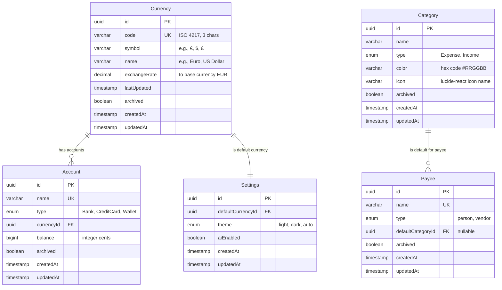

# Data Model: Core Master Tables & App Setup

**Feature**: 002-master-tables  
**Date**: 2025-10-24  
**Status**: Design Complete

---

## Entity Relationship Diagram



---

## Entity Definitions

### 1. Currency (No Dependencies)

**Purpose**: Defines available currencies for accounts and multi-currency support.

**Table Name**: `currencies`

**Fields**:
| Field | Type | Constraints | Description |
|-------|------|-------------|-------------|
| `id` | UUID | PRIMARY KEY | Unique identifier |
| `code` | VARCHAR(3) | NOT NULL, UNIQUE | ISO 4217 currency code (e.g., EUR, USD) |
| `symbol` | VARCHAR(10) | NOT NULL | Display symbol (€, $, £) |
| `name` | VARCHAR(100) | NOT NULL | Full name (Euro, US Dollar) |
| `exchangeRate` | DECIMAL(18,6) | NOT NULL, DEFAULT 1.0 | Exchange rate to base currency (EUR) |
| `lastUpdated` | TIMESTAMP | NOT NULL | When exchange rate was last updated |
| `archived` | BOOLEAN | NOT NULL, DEFAULT false | Soft delete flag |
| `createdAt` | TIMESTAMP | NOT NULL, DEFAULT NOW() | Record creation timestamp |
| `updatedAt` | TIMESTAMP | NOT NULL, DEFAULT NOW() | Record update timestamp |

**Indexes**:
- PRIMARY KEY on `id`
- UNIQUE INDEX on `code`
- INDEX on `archived` (for filtered queries)

**Business Rules**:
- ISO 4217 code validation enforced by application (Zod schema)
- EUR currency seeded by default with exchange rate 1.0
- Cannot delete currency if accounts reference it (FK constraint)
- Exchange rate changes update `lastUpdated` timestamp

**Drizzle Schema**:
```typescript
export const currencies = pgTable('currencies', {
  id: uuid('id').primaryKey().defaultRandom(),
  code: varchar('code', { length: 3 }).notNull().unique(),
  symbol: varchar('symbol', { length: 10 }).notNull(),
  name: varchar('name', { length: 100 }).notNull(),
  exchangeRate: decimal('exchange_rate', { precision: 18, scale: 6 }).notNull().default('1.0'),
  lastUpdated: timestamp('last_updated').notNull().defaultNow(),
  archived: boolean('archived').notNull().default(false),
  createdAt: timestamp('created_at').notNull().defaultNow(),
  updatedAt: timestamp('updated_at').notNull().defaultNow(),
});
```

---

### 2. Settings (Depends on Currency)

**Purpose**: Application-level user preferences (singleton record).

**Table Name**: `settings`

**Fields**:
| Field | Type | Constraints | Description |
|-------|------|-------------|-------------|
| `id` | UUID | PRIMARY KEY | Unique identifier (only one record) |
| `defaultCurrencyId` | UUID | NOT NULL, FK → currencies(id) | Default currency for new accounts |
| `theme` | ENUM | NOT NULL, DEFAULT 'light' | UI theme: 'light', 'dark', 'auto' |
| `aiEnabled` | BOOLEAN | NOT NULL, DEFAULT true | Enable AI-powered features |
| `createdAt` | TIMESTAMP | NOT NULL, DEFAULT NOW() | Record creation timestamp |
| `updatedAt` | TIMESTAMP | NOT NULL, DEFAULT NOW() | Record update timestamp |

**Indexes**:
- PRIMARY KEY on `id`
- FOREIGN KEY on `defaultCurrencyId` → `currencies(id)` RESTRICT

**Business Rules**:
- Only one record exists per installation (enforced by application)
- Auto-created on first access if missing (EUR currency as default)
- Cannot delete (no delete endpoint)
- Changing `defaultCurrencyId` requires currency to exist and not be archived

**Drizzle Schema**:
```typescript
export const themeEnum = pgEnum('theme', ['light', 'dark', 'auto']);

export const settings = pgTable('settings', {
  id: uuid('id').primaryKey().defaultRandom(),
  defaultCurrencyId: uuid('default_currency_id').notNull().references(() => currencies.id, { onDelete: 'restrict' }),
  theme: themeEnum('theme').notNull().default('light'),
  aiEnabled: boolean('ai_enabled').notNull().default(true),
  createdAt: timestamp('created_at').notNull().defaultNow(),
  updatedAt: timestamp('updated_at').notNull().defaultNow(),
});
```

---

### 3. Category (No Dependencies)

**Purpose**: Transaction classification for expenses and income.

**Table Name**: `categories`

**Fields**:
| Field | Type | Constraints | Description |
|-------|------|-------------|-------------|
| `id` | UUID | PRIMARY KEY | Unique identifier |
| `name` | VARCHAR(100) | NOT NULL | Category name |
| `type` | ENUM | NOT NULL | 'Expense' or 'Income' |
| `color` | VARCHAR(7) | NOT NULL | Hex color code (#RRGGBB) |
| `icon` | VARCHAR(50) | NOT NULL | lucide-react icon name |
| `archived` | BOOLEAN | NOT NULL, DEFAULT false | Soft delete flag |
| `createdAt` | TIMESTAMP | NOT NULL, DEFAULT NOW() | Record creation timestamp |
| `updatedAt` | TIMESTAMP | NOT NULL, DEFAULT NOW() | Record update timestamp |

**Indexes**:
- PRIMARY KEY on `id`
- UNIQUE INDEX on `(name, type)` - case-insensitive (enforced by application)
- INDEX on `(type, archived)` (for filtered queries)

**Business Rules**:
- 20 default categories seeded (15 Expense, 5 Income)
- Duplicate names within same type not allowed (case-insensitive)
- Cannot delete if transactions reference it (checked by application)
- Archiving preserves historical transaction categorization

**Drizzle Schema**:
```typescript
export const categoryTypeEnum = pgEnum('category_type', ['Expense', 'Income']);

export const categories = pgTable('categories', {
  id: uuid('id').primaryKey().defaultRandom(),
  name: varchar('name', { length: 100 }).notNull(),
  type: categoryTypeEnum('type').notNull(),
  color: varchar('color', { length: 7 }).notNull(),
  icon: varchar('icon', { length: 50 }).notNull(),
  archived: boolean('archived').notNull().default(false),
  createdAt: timestamp('created_at').notNull().defaultNow(),
  updatedAt: timestamp('updated_at').notNull().defaultNow(),
}, (table) => ({
  uniqueNameType: uniqueIndex('categories_name_type_unique').on(table.name, table.type),
  typeArchivedIdx: index('categories_type_archived_idx').on(table.type, table.archived),
}));
```

---

### 4. Account (Depends on Currency)

**Purpose**: Financial accounts (bank, credit card, wallet) that hold transactions.

**Table Name**: `accounts`

**Fields**:
| Field | Type | Constraints | Description |
|-------|------|-------------|-------------|
| `id` | UUID | PRIMARY KEY | Unique identifier |
| `name` | VARCHAR(100) | NOT NULL, UNIQUE | Account name |
| `type` | ENUM | NOT NULL | 'Bank', 'CreditCard', 'Wallet' |
| `currencyId` | UUID | NOT NULL, FK → currencies(id) | Account currency |
| `balance` | BIGINT | NOT NULL, DEFAULT 0 | Current balance (integer cents) |
| `archived` | BOOLEAN | NOT NULL, DEFAULT false | Soft delete flag |
| `createdAt` | TIMESTAMP | NOT NULL, DEFAULT NOW() | Record creation timestamp |
| `updatedAt` | TIMESTAMP | NOT NULL, DEFAULT NOW() | Record update timestamp |

**Indexes**:
- PRIMARY KEY on `id`
- UNIQUE INDEX on `name`
- FOREIGN KEY on `currencyId` → `currencies(id)` RESTRICT
- INDEX on `(type, archived)` (for filtered queries)

**Business Rules**:
- Balance stored as integer cents (e.g., €10.50 = 1050 cents)
- Initial balance set on account creation
- Balance updated by transactions (future phase)
- Cannot delete if transactions exist (checked by application)
- Changing currency after transactions requires conversion warning (future phase)

**Drizzle Schema**:
```typescript
export const accountTypeEnum = pgEnum('account_type', ['Bank', 'CreditCard', 'Wallet']);

export const accounts = pgTable('accounts', {
  id: uuid('id').primaryKey().defaultRandom(),
  name: varchar('name', { length: 100 }).notNull().unique(),
  type: accountTypeEnum('type').notNull(),
  currencyId: uuid('currency_id').notNull().references(() => currencies.id, { onDelete: 'restrict' }),
  balance: bigint('balance', { mode: 'number' }).notNull().default(0),
  archived: boolean('archived').notNull().default(false),
  createdAt: timestamp('created_at').notNull().defaultNow(),
  updatedAt: timestamp('updated_at').notNull().defaultNow(),
}, (table) => ({
  typeArchivedIdx: index('accounts_type_archived_idx').on(table.type, table.archived),
}));
```

---

### 5. Payee (Optional FK to Category)

**Purpose**: Optional master data for merchants/people to enable autocomplete and default categorization.

**Table Name**: `payees`

**Fields**:
| Field | Type | Constraints | Description |
|-------|------|-------------|-------------|
| `id` | UUID | PRIMARY KEY | Unique identifier |
| `name` | VARCHAR(100) | NOT NULL, UNIQUE | Payee name |
| `type` | ENUM | NOT NULL | 'person' or 'vendor' |
| `defaultCategoryId` | UUID | NULLABLE, FK → categories(id) | Default category for transactions |
| `archived` | BOOLEAN | NOT NULL, DEFAULT false | Soft delete flag |
| `createdAt` | TIMESTAMP | NOT NULL, DEFAULT NOW() | Record creation timestamp |
| `updatedAt` | TIMESTAMP | NOT NULL, DEFAULT NOW() | Record update timestamp |

**Indexes**:
- PRIMARY KEY on `id`
- UNIQUE INDEX on `name`
- FOREIGN KEY on `defaultCategoryId` → `categories(id)` SET NULL (nullable)
- INDEX on `archived` (for filtered queries)

**Business Rules**:
- Optional feature (users can skip payee tracking)
- Default category is suggestion only (doesn't override user choice)
- Hard delete allowed if no transactions reference it
- Soft delete (archive) if transactions exist
- Autocomplete search should match partial names (case-insensitive)

**Drizzle Schema**:
```typescript
export const payeeTypeEnum = pgEnum('payee_type', ['person', 'vendor']);

export const payees = pgTable('payees', {
  id: uuid('id').primaryKey().defaultRandom(),
  name: varchar('name', { length: 100 }).notNull().unique(),
  type: payeeTypeEnum('type').notNull(),
  defaultCategoryId: uuid('default_category_id').references(() => categories.id, { onDelete: 'set null' }),
  archived: boolean('archived').notNull().default(false),
  createdAt: timestamp('created_at').notNull().defaultNow(),
  updatedAt: timestamp('updated_at').notNull().defaultNow(),
}, (table) => ({
  archivedIdx: index('payees_archived_idx').on(table.archived),
}));
```

---

## Foreign Key Relationships

### Currency → Account (One-to-Many)
- **Relationship**: One currency can have many accounts
- **Cascade Rule**: RESTRICT - prevents deleting currency if accounts reference it
- **Business Logic**: User must reassign or delete all accounts before deleting currency

### Currency → Settings (One-to-One)
- **Relationship**: Settings has one default currency
- **Cascade Rule**: RESTRICT - prevents deleting default currency
- **Business Logic**: Must change default currency before deleting EUR (or current default)

### Category → Payee (One-to-Many, Optional)
- **Relationship**: One category can be default for many payees
- **Cascade Rule**: SET NULL - allows category deletion, nullifies payee default
- **Business Logic**: Deleting category removes default from payees but preserves payee records

---

## Migration Strategy

### Migration File: `drizzle/migrations/0002_master_tables.sql`

**Order of Table Creation** (respects dependencies):
1. **Currency** (no dependencies)
2. **Category** (no dependencies)
3. **Settings** (depends on Currency)
4. **Account** (depends on Currency)
5. **Payee** (depends on Category - optional FK)

**Seed Data** (via `server/db/seed.ts`, not migration):
1. EUR currency (code: 'EUR', symbol: '€', rate: 1.0)
2. 20 default categories (15 Expense, 5 Income)
3. Default settings record (EUR as default, light theme, AI enabled)

**Rollback Strategy**:
- Drop tables in reverse order (Payee, Account, Settings, Category, Currency)
- Cascading drops handle foreign keys automatically
- No data migration needed (fresh install)

---

## Index Strategy

### Performance Optimization

**Query Patterns**:
1. **List entities filtered by archived status** → Index on `(type, archived)` or `archived`
2. **Lookup by unique name** → Unique index on `name` or `(name, type)`
3. **Foreign key lookups** → Automatic index on FK columns (currencyId, defaultCategoryId)
4. **Currency code lookup** → Unique index on `code`

**Index Decisions**:
- **Currencies**: `code` unique index (frequent lookups by code)
- **Categories**: `(name, type)` composite unique index, `(type, archived)` for filtered lists
- **Accounts**: `name` unique index, `(type, archived)` for grouped lists
- **Payees**: `name` unique index, `archived` for filtered lists
- **Settings**: No additional indexes (singleton, always lookup by PK)

---

## Data Integrity Rules

### Constitutional Requirements

1. **All monetary values as integer cents** ✅
   - Account balance stored as BIGINT (cents)
   - Decimal.js used in application for calculations
   - No floating-point arithmetic in database

2. **ISO 8601 UTC timestamps** ✅
   - `createdAt`, `updatedAt` on all tables
   - `lastUpdated` on Currency for exchange rate tracking
   - PostgreSQL TIMESTAMP type (UTC)

3. **Soft deletes preferred** ✅
   - `archived` boolean on all entities
   - Preserves historical data integrity
   - UI filters by `archived: false` by default

4. **No magic strings** ✅
   - Enums for all finite value sets (AccountType, CategoryType, PayeeType, Theme)
   - ISO 4217 validation for currency codes
   - Icon names from curated list (lucide-react)

### Application-Level Validation

- **Unique constraints** enforced case-insensitively (application Zod validation)
- **Currency code validation** against ISO 4217 list (application constant)
- **Color validation** hex format #RRGGBB (Zod regex)
- **Icon validation** against curated lucide-react list (Zod enum)
- **Transaction count checks** before delete/archive (application query)

---

## Summary

**Total Entities**: 5  
**Total Tables**: 5  
**Total Enums**: 5 (AccountType, CategoryType, PayeeType, Theme, plus internal enums)  
**Foreign Keys**: 4 (Currency → Account, Currency → Settings, Category → Payee, Account self-reference future)  
**Indexes**: 12 (6 unique, 6 performance)  
**Seed Records**: 22 (1 EUR currency, 20 categories, 1 settings)

**Dependencies**:
- Currency must be created before Settings and Account
- Category must exist for Payee optional FK
- Settings singleton created after Currency seed

**Next Steps**: Generate API contracts in `contracts/` directory.
